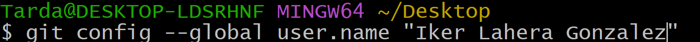
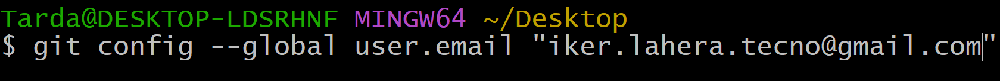
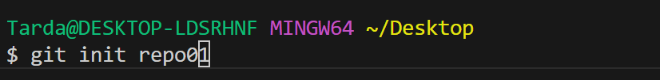
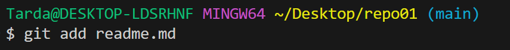
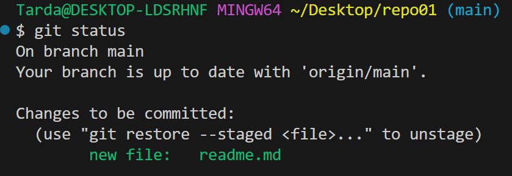
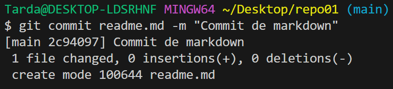
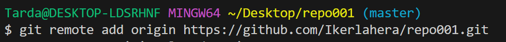
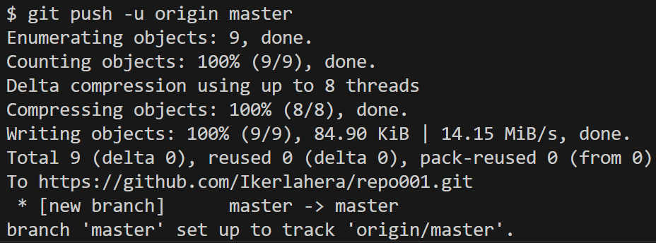

# Crear repositiorio en git

1. Añado el usuario

2. Y el email 
   

3. Utilizando el comando git init "nombre del repositorio", creamos una carpeta que contiene un repositorio de git en su interior.

4. Añado el fichero al stagin area con el comando add.

5. Compruebo el estado.

 

6. Y ahora hago un commit al repositorio local. El fichero ahora esta en estado "Commited"

7. Si hacemos un push da un error, si hacemos un git remote -v veremos que no aparece nada, esto se debe a que no tenemos el repositorio local asociado a ningun repositorio remoto.  Para añadir el repositorio local al repositorio remoto utilizo el comando "git remote add origin" y el enlace al repositorio remoto.

8. Para hacer el primer push lo pongo con -u origin master o --set-upstream origin master. Para los proximos push bastara con poner simplemente un git push
